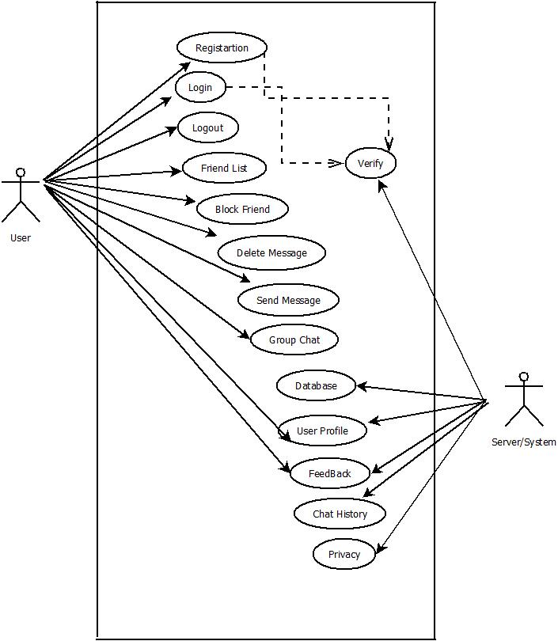
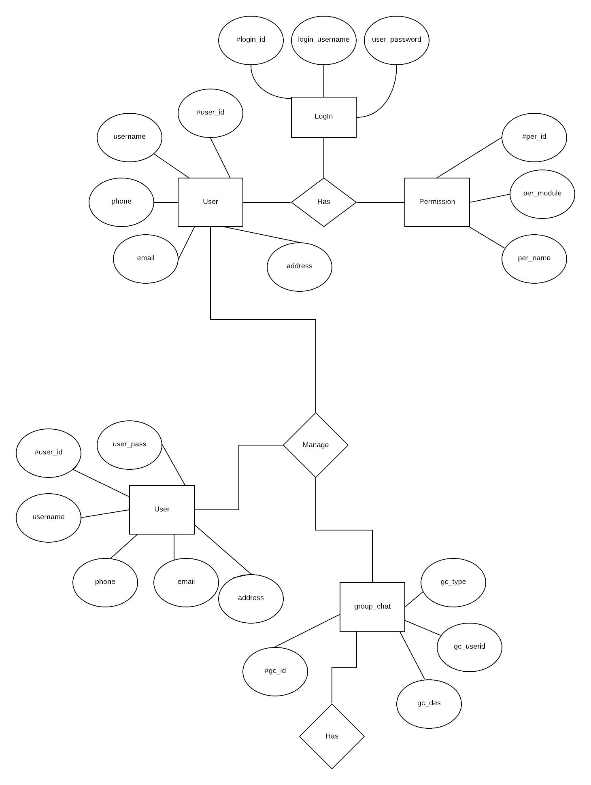
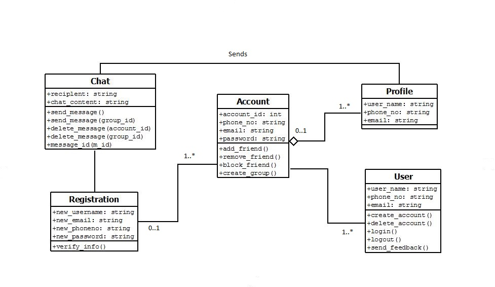
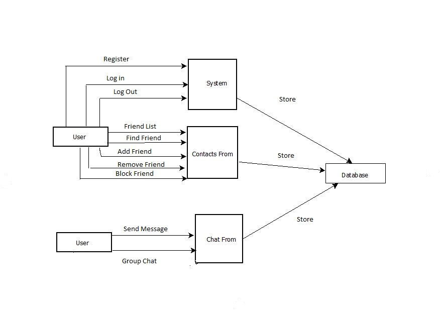

# **Messenger(Web Version)**
## **Introduction:**
The world is becoming smaller and smaller day by day because of the global village. By using this application, any user will be able to connect with their friends and family anytime. They can send the message in groups also. Nowadays people want to communicate with another easily that’s why we want to prepare this application.
 
## **Background Study**
For our app, we have looked at various pre-existing messenger apps in order to know about their construction as well to learn about what types of features to implement. Some of the apps we have studied are :
 
Whatsapp &
Facebook Messenger.
 
We have looked at these apps for feature ideas as well as some design knowledge. We have also tried to analyze pre-existing features and try to improve on them or to complement them.
 
## **Sources:**
1.  	https://en.wikipedia.org/wiki/WhatsApp
2.  	https://en.wikipedia.org/wiki/Facebook_Messenger
 
 
## **Requirement Analysis: **
 
1.      User Category:
 
There are 1-types of Users here. They are:
 
·         User
 
2.      Feature List:
 
In this project the “User” has the following features:
 
·         User need to do his/her registration first.
·         User can log in with his username & password.
·         User can see the friend list.
·         User can send a message.
·         User can delete the message.
·         User can block friends.
·         User can chat in the group.
·         User can send feedback.
 
## **Use Case Diagram**

## **ER Diagram**

## **Class Diagram**

## **Data Flow Diagram**

## **Impact of This Project**

*The world is becoming smaller and smaller day by day because of the global village. By using this application, any user will be able to connect with their friends and family anytime. It has much privacy that they will be able to send their important information via this application. The users will be able to send any types of files, emoji and so on. They can find new friends which will enhance their networking and for the privacy issue, they will be able to block other users.*

## **Limitations and Possible Future Improvements**

*The time period for this project is very short. So it has many limitations and scopes for future improvements. First of all, here we haven't added the video calling system which will be implemented in the near future. We haven't used artificial intelligence here which will be added to cope up with the future. And we are planning to add my story/day, a news feed, chatbot and so on. And day by day, the privacy of the users will be enhancing.*

